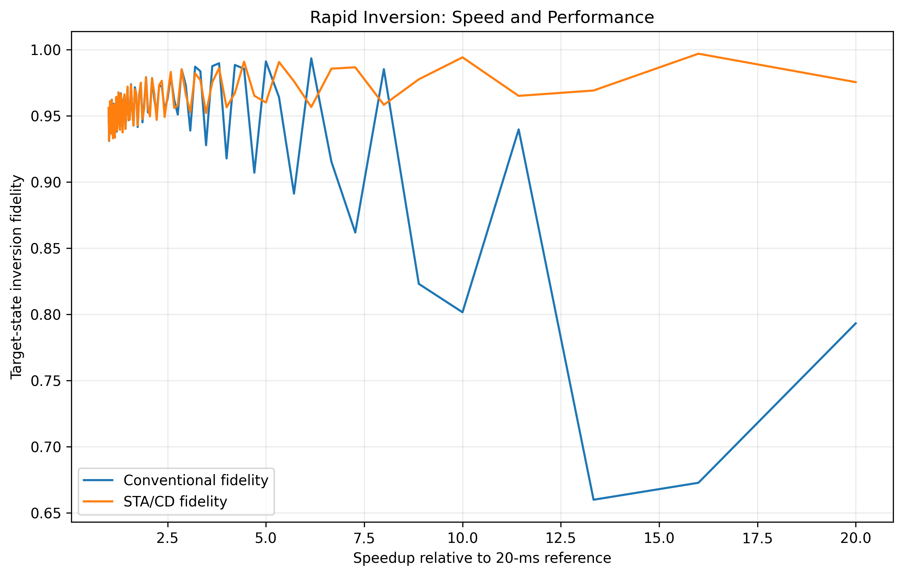
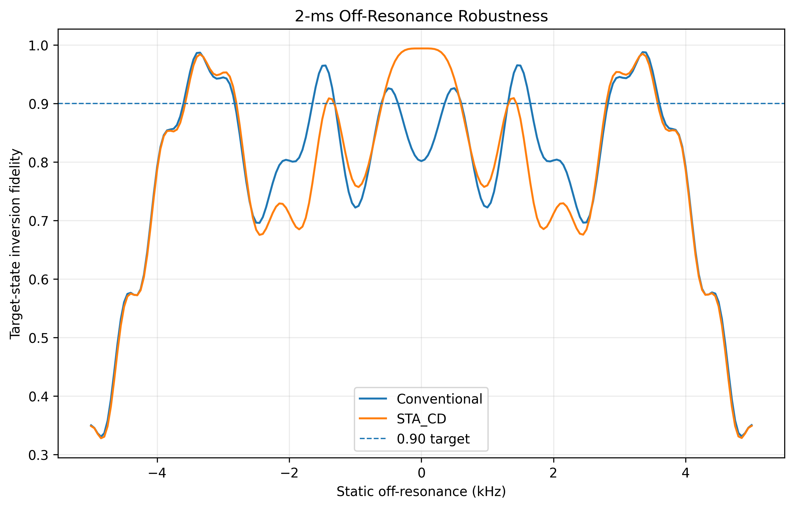
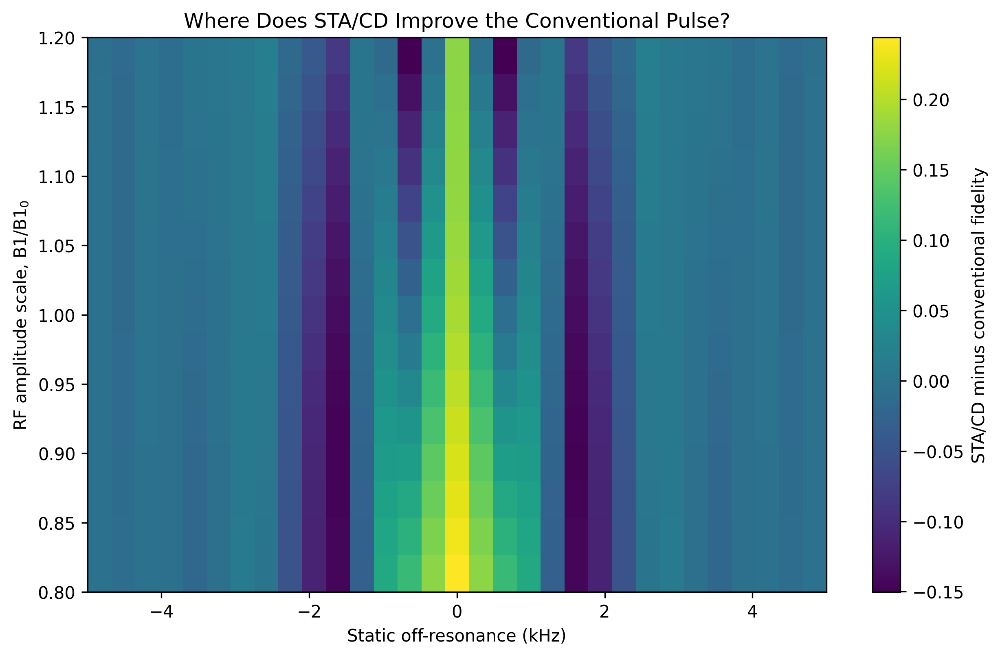
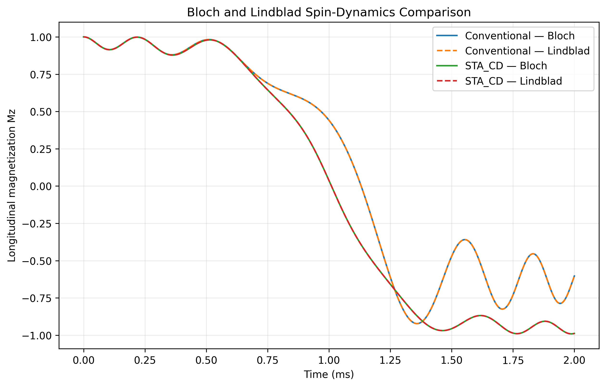

<div align="center">

# ⚡ STA Spin Dynamics

### Counterdiabatic Shortcuts to Adiabaticity for Rapid MRI Spin Inversion

*Dissipative Bloch-equation simulations · robustness studies · RF control cost*


</div>

---

## 🔬 Overview

This repository tests whether a **counterdiabatic (CD) shortcut-to-adiabaticity** pulse can invert spins in milliseconds, instead of the slow chirped adiabatic pulses used in MRI, while keeping high fidelity under relaxation and field imperfections.

**Common model:** rotating-frame Bloch equations, T1 = 1.5 s, T2 = 80 ms, linear chirp, CD term ω_y = −dθ/dt, solved with `scipy.integrate.solve_ivp`.

**Headline result (2 ms pulse):** Mz = −0.988 (STA/CD) vs −0.603 (conventional chirp).

## 🗂️ Repository structure

```text
STA-Spin-Dynamics/
├── scripts/      # simulation code (common_model.py + 01–10)
├── results/      # CSV outputs
├── figures/      # publication-style PNG figures
├── docs/         # usage guide, validation report, detailed README
├── requirements.txt
└── README.md
```

## 🧪 Simulations

| Tier | Script | Question | Figure |
|---|---|---|---|
| 2 | `01_off_resonance_sweep.py` | Fixed 2 ms pulse vs static offset? | `figure_T2_off_resonance_2ms.png` |
| 2 | `02_T2_sensitivity.py` | Does the conclusion survive T2 changes? | `figure_T2_T2_sensitivity.png` |
| 2 | `03_T1_sensitivity.py` | Sensitivity to T1 | `figure_T2_T1_sensitivity.png` |
| 2 | `04_closed_vs_dissipative.py` | Nonadiabatic loss vs relaxation loss | `figure_T2_closed_vs_dissipative.png` |
| 2 | `05_numerical_convergence.py` | Are results numerical artifacts? | `figure_T2_numerical_convergence.png` |
| 3 | `06_B1_offresonance_map.py` | Joint B1 / offset robustness map | `figure_T3_*_B1_offresonance.png` |
| 3 | `07_rf_control_cost.py` | Control cost paid for the speed gain | `figure_T3_control_cost.png` |
| 3 | `08_speed_performance_cost.py` | Speed vs fidelity vs cost summary | `figure_T3_speed_performance_cost.png` |
| 4 | `09_sta_ensemble_parameter_optimization.py` | Ensemble-aware parameter optimization (prototype) | exploratory |
| 4 | `10_bloch_vs_lindblad.py` | Bloch vs density-matrix Lindblad check | `figure_T4_bloch_vs_lindblad.png` |

## 🖼️ Selected figures

<p align="center">
  
  
</p>
<p align="center">
  
  
</p>

## 🚀 Quick start

```bash
git clone https://github.com/SuDiptoRoy994/STA-Spin-Dynamics.git
cd STA-Spin-Dynamics
python -m pip install -r requirements.txt
python scripts/01_off_resonance_sweep.py
```

Run scripts `01 → 10` in order. Larger maps: set `STA_B1_POINTS` and `STA_OFF_POINTS`.

## ⚠️ Honest limitations

- Single effective spin-1/2 with phenomenological T1/T2 (no spatial or multi-pool effects).
- Robustness tests use a **fixed nominal pulse**; the CD waveform is not redesigned per perturbation.
- `J_RF` is a control-cost proxy, **not SAR**.
- Script `09` is an exploratory prototype, not a validated result.
- Simulation only; no experimental validation.

See [`docs/VALIDATION_REPORT.md`](docs/VALIDATION_REPORT.md) for what was executed and verified.

## 📄 Related work

- Simulation manuscript: *Counterdiabatic Shortcuts to Adiabaticity for Rapid MRI Spin Inversion: A Dissipative Bloch-Equation Simulation Study*
- Perspective: *The Adiabatic Paradox in Biological Tissue*

## 👤 Author

**Sudipto Roy (Dipto)** · M.S. Applied Physics & Electronics, Jahangirnagar University
Interests: medical & biomedical physics · plasma · quantum control

## 📜 License

Add a `LICENSE` file (MIT recommended for code) before making the repo public.

## 📚 Citation

```bibtex
@software{roy_sta_spin_dynamics,
  author = {Roy, Sudipto},
  title  = {STA-Spin-Dynamics: Counterdiabatic spin inversion simulations},
  year   = {2026},
  url    = {https://github.com/SuDiptoRoy994/STA-Spin-Dynamics}
}
```
